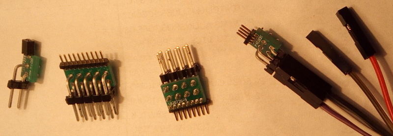

# Adapter PCB Board beteen 100mil and 50mil headers

The key feature is that the width of the adapter is equal to the width of the
50mil header, so headers that are close together on the board can be used
simultaneously, and the mating is secure without any inbalance (as would result
if the adapter had upward facing connectors next to each other on opposite
sides).

Useful for programming the WISP5 and other boards. Also, useful for accessing
compact 50mil debug headers on boards directly with Saleae logic analyzer
female 100mil wire probes (without the clip).

Variants: 2-pin, 4-pin, 6-pin, 8-pin, 10-pin, 12-pin

This repository contains an Altium project per each variant.

Gerber files for manufacturing, are in a .zip file in `Project Outputs`
subfolder in each variant folder.

BOM
---

| Mfg PN            | Digikey PN    | Description |
| ----------------- | ------------- | ----------- |
| TSW-150-08-T-D-RA | SAM1049-50-ND | CONN HEADR 100PS .100 DL R/A TIN |
| GRPB501VWCN-RC    | S9016E-50-ND  | CONN HEADER .050\'\' 50POS PCB R/A |
